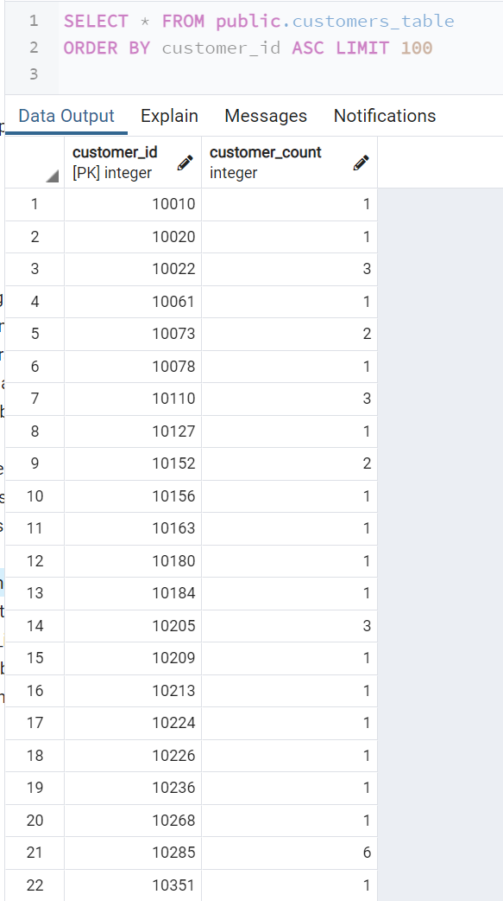
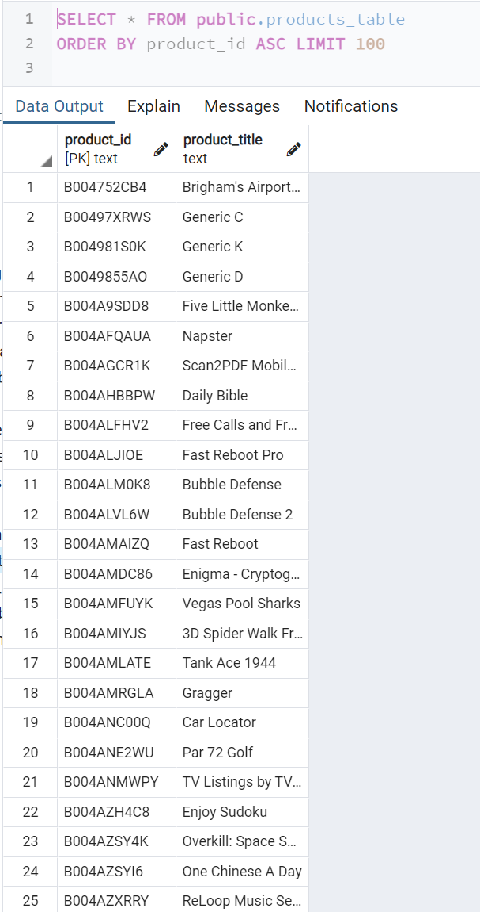
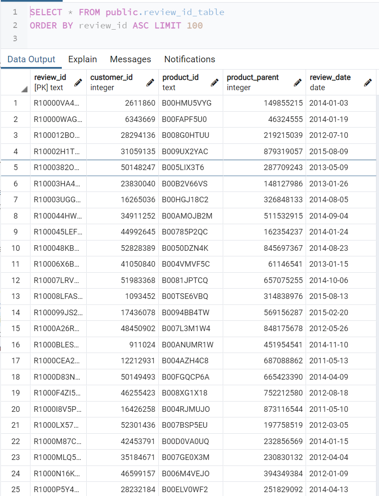
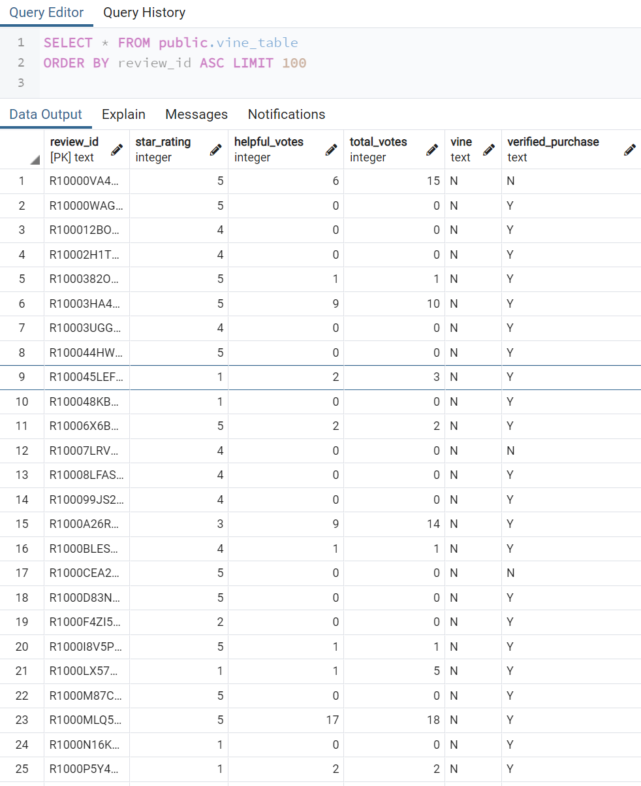
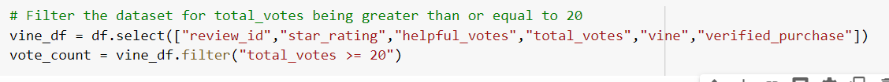
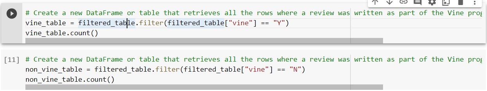
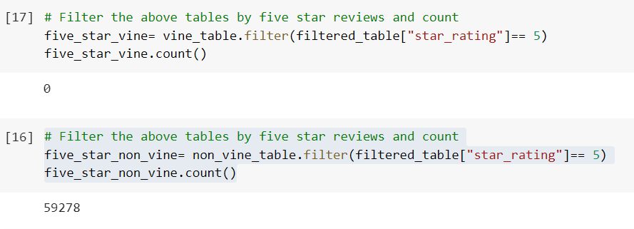
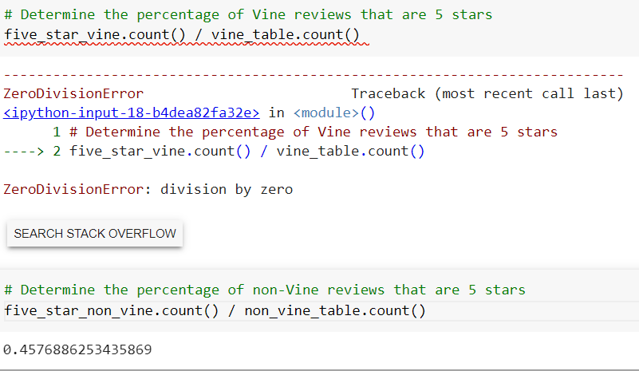

# Amazon Vine Analysis Project

## Overview of Project
  Utilize the datasets and use PySpark to perform the ETL process to extract the dataset, transform the data, connect to an AWS RDS instance, and load the transformed data into pgAdmin. Then, use PySpark to determine if there is any bias toward favorable reviews from Vine members in your dataset.
  
### Purpose:   
   The purpose of this analysis to see if the dataset shows any bias toward favorable reviews from Amazon Vine members. In order to determine the bias, we proceed two technical analysis as follows:
   
  Two technical analysis deliverables
  - Perform ETL on Amazon Product Reviews
  - Determine Bias of Vine Reviews

### Reources
- S3 Amazon Data Sets Link list: _Amason Review datasets_: <https://s3.amazonaws.com/amazon-reviews-pds/tsv/index.txt>
- Used S3 link <https://s3.amazonaws.com/amazon-reviews-pds/tsv/amazon_reviews_us_Mobile_Apps_v1_00.tsv.gz>
- Used Software and Service: Amazon RDS, S3, PySpark, pgAdmin 4

## Analysis 

 - Perform ETL on Amazon Product Reviews
  1. From Amazon Review datasets, we chose `<https://s3.amazonaws.com/amazon-reviews-pds/tsv/amazon_reviews_us_Mobile_Apps_v1_00.tsv.gz>` 
  2. Create a new database with Amazon RDS. We name the server "kuma1210-project."
  3. In pgAdmin, create a new database in Amazon RDS server. We name the new database "amazon_vine_analysis."
  4. Run the `challenge_schema.sql` query in pgAdmin to create the tables for new database. Confirm that we have four tables: `customers_table`, `products_table`, `review_id_table`, and `vine_table`.
  5. Run `Amazon_Reviews_ETL` file on a Google Colab Notebook to extract the dataset into each DataFrame
  - Load the dataset into dataframe to transform

  
  
  - `customers_table`
  
  
  - `products_table`
  
  
  - `review_id_table`
  
  
  - `vine_table`
  
  
  
  6. Connect to the AWS RDS instance and write each DataFrame to its table
  
  
  
  7. Confrim that the dataframes are properly imported to the tables in pgAdmin database.

 
 
 
  
 
   
 
 
 - Determine the bias of Vine reviews
 1. Set up the PySpark session and load dataset from S3 on Google Colab notebook.
 2. Filter the dataset for total_votes being greater than or equal to 20.
 
 
 
 3. Find the number of Vine reviews and non-Vine reviews 
 
 
 
 4. Find the number of 5 stars review by Vine and non-Vine.
 
 
  
 5 Calculate the percentage of Vine and non-Vine reviews that were 5 stars.
 
 

 
## Results
- How many Vine reviews and non-Vine reviews were there?

Based on the output from PySpark, we actually find out that Vine review is 0 and non-Vine review is 129,516. In fact the `filtered_table.count()` is also 129,516 and proves that all reviews were done by non-Vine.

- How many Vine reviews were 5 stars? How many non-Vine reviews were 5 stars?

The PySpark shows that non-Vine reviews were 59,278.

- What percentage of Vine reviews were 5 stars? What percentage of non-Vine reviews were 5 stars?

The percentage of non-Vine review that were 5 stars is 0.458%.

## Summary
  Unfortunately, this dataset is not possible to measure bias on positive reviews by paid-members because there was 0 review done by Vine. Therefore, we could not compare the percentage of 5 stars Vine review and 5 stars non-Vine reviews. 
  Below are ideas of we additional analysis we can do to determine whether we implement paid review for this markets.
  1. Given the 5 stars review by non-Vine is 0.458%, we should analyse other dataset and compare the percentage of non-Vine reviews that are 5 stars. If the current dataset's percentage is not significantly lower compared to the percentage of other datasets, we would not need to hire paid reviewers to increase the 5 star reviews.
  2. If we see the current dataset's percentage is significantly lower, we should assess if other dataset is experiencing the positive bias for having paid reviews. Then consider implementing paid reviewer for this market as well. 

