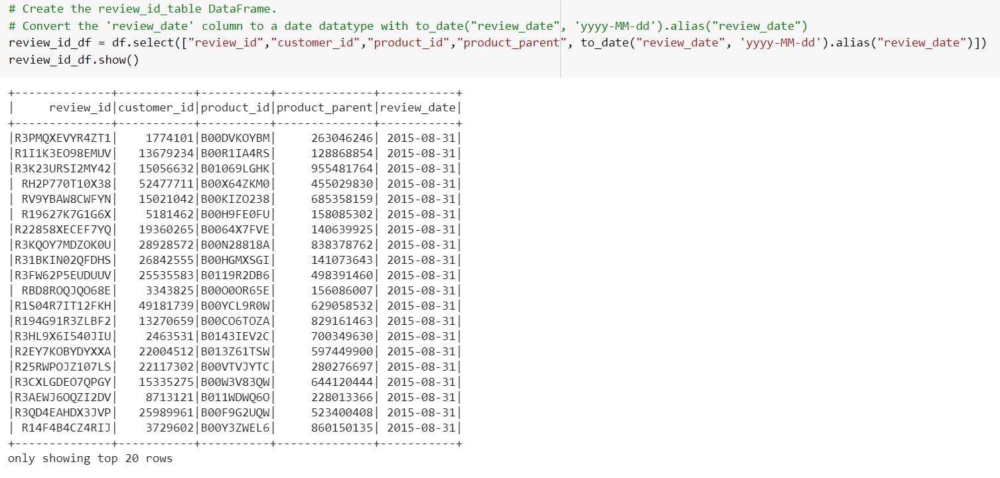

# Amazon Vine Analysis Project

## Overview of Project
  Utilize the datasets and use PySpark to perform the ETL process to extract the dataset, transform the data, connect to an AWS RDS instance, and load the transformed data into pgAdmin. Then, use PySpark to determine if there is any bias toward favorable reviews from Vine members in your dataset.
  
### Purpose:   
   The purpose of this analysis to see if the chosen data set has any biad toward favorable reviews from Amazon Vine members 
   
  Two technical analysis deliverables
  - Perform ETL on Amazon Product Reviews
  - Determine Bias of Vine Reviews

### Reources
- S3 Amazon Data Sets Link list: _Amason Review datasets_: <https://s3.amazonaws.com/amazon-reviews-pds/tsv/index.txt>
- Used S3 link <https://s3.amazonaws.com/amazon-reviews-pds/tsv/amazon_reviews_us_Mobile_Apps_v1_00.tsv.gz>
- Used Software and Service: Amazon RDS, S3, PySpark, pgAdmin 4

## Analysis 

 - Perform ETL on Amazon Product Reviews
  1. From Amazon Review datasets, we chose `<https://s3.amazonaws.com/amazon-reviews-pds/tsv/amazon_reviews_us_Mobile_Apps_v1_00.tsv.gz>` 
  2. Create a new database with Amazon RDS. We name the server "kuma1210-project."
  3. In pgAdmin, create a new database in Amazon RDS server. We name the new database "amazon_vine_analysis."
  4. Run the `challenge_schema.sql` query in pgAdmin to create the tables for new database. Confirm that we have four tables: `customers_table`, `products_table`, `review_id_table`, and `vine_table`.
  5. Run `Amazon_Reviews_ETL` file on a Google Colab Notebook to extract the dataset into each DataFrame
  - Load the dataset into dataframe to transform

  
  
  - `customers_table`
  
  
  - `products_table`
  
  
  - `review_id_table`
  
  
  - `vine_table`
  
  
  
  6. Connect to the AWS RDS instance and write each DataFrame to its table
  
  
